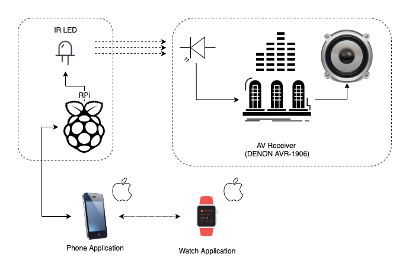

# Remote control for old sound amplifier/AV-receiver Denon

Raspberry Pi Zero-W with Linux Infra-Red Control library (https://lirc.org/) and IR-LED connected to one of GPIOs runs server application to receive commands from the phone/watch clients over UDP.

Figure 1, diagram:

IPhone/Watch applications:
https://github.com/arachnothrone/denon-remote-clients

...
